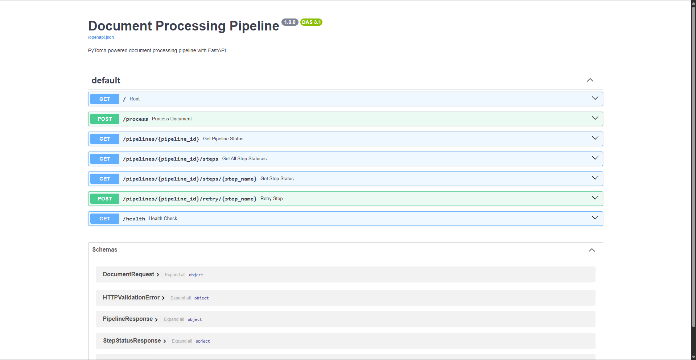
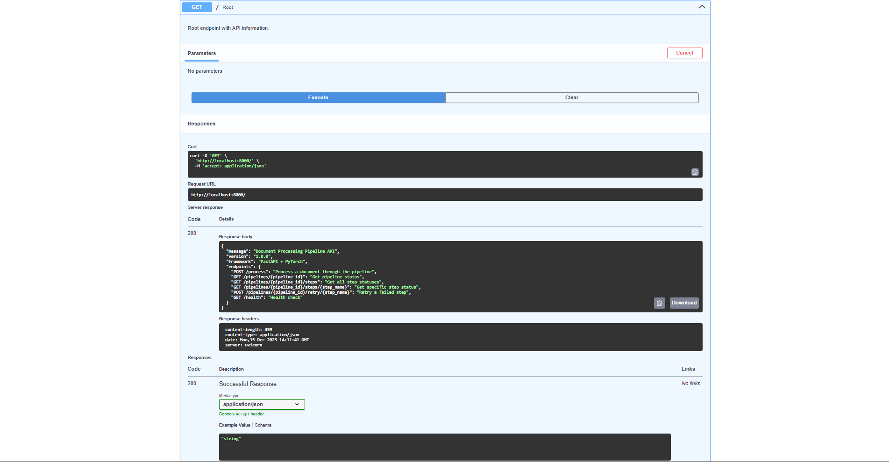
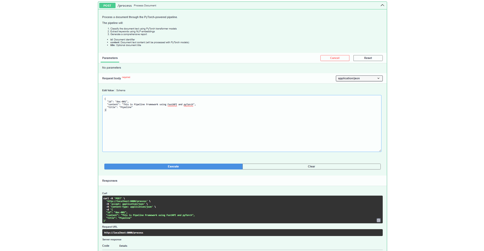
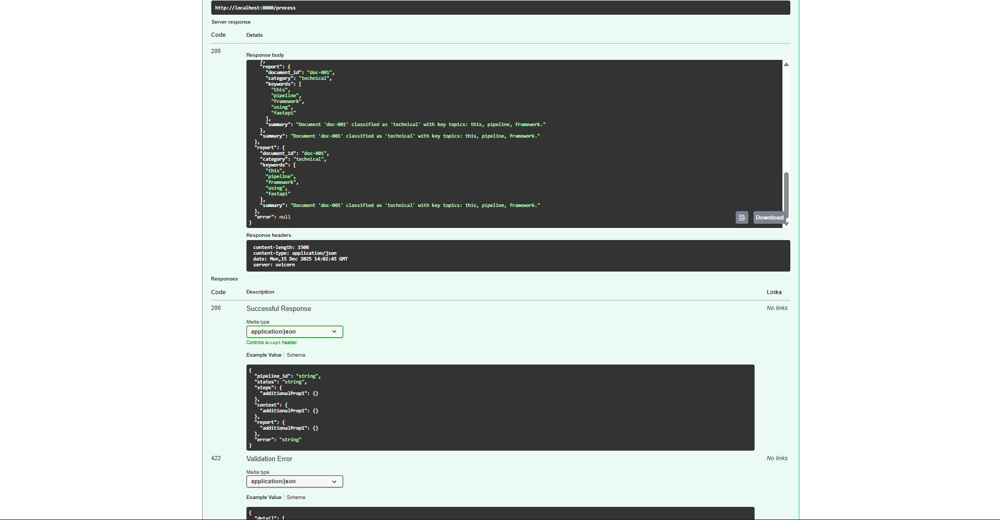
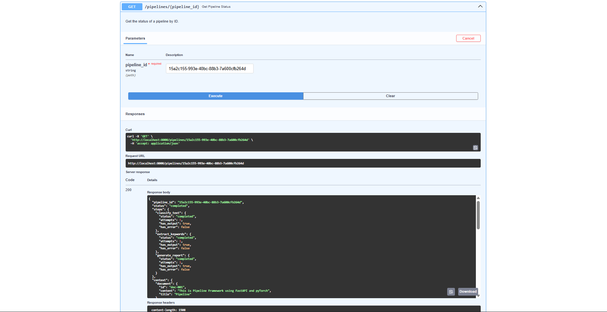
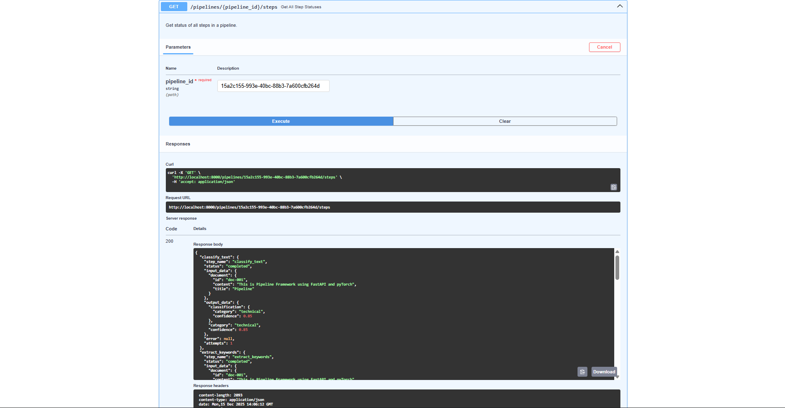
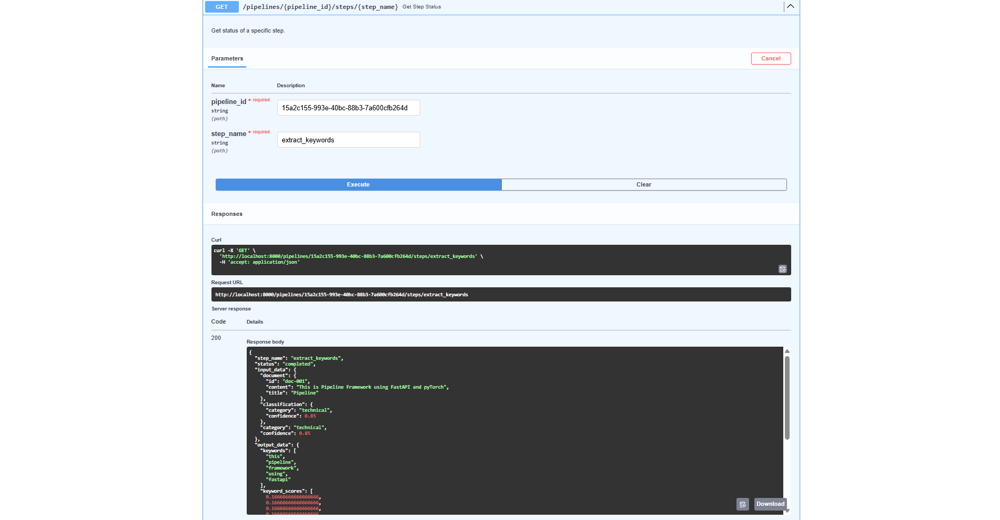
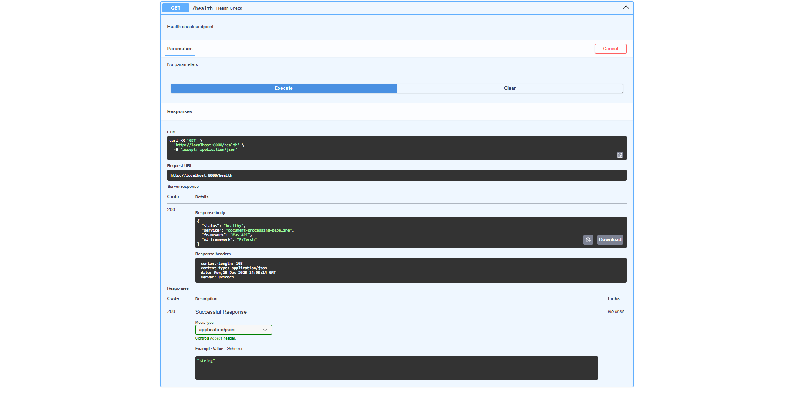

# Usage Guide: Document Processing Pipeline

This guide demonstrates how to use the Document Processing Pipeline API powered by FastAPI and PyTorch.

## Getting Started

### Start the API Server

First, start the FastAPI server:

```bash
python document_processing/main.py
```

The API will be available at `http://localhost:8000`

### Access API Documentation

Open your browser and navigate to:
- **Swagger UI**: `http://localhost:8000/docs`
- **ReDoc**: `http://localhost:8000/redoc`

## API Overview

The Swagger UI provides an interactive interface to explore and test all available endpoints:



The API includes the following endpoints:
- `GET /` - Root endpoint with API information
- `POST /process` - Process a document through the pipeline
- `GET /pipelines/{pipeline_id}` - Get pipeline status
- `GET /pipelines/{pipeline_id}/steps` - Get all step statuses
- `GET /pipelines/{pipeline_id}/steps/{step_name}` - Get specific step status
- `POST /pipelines/{pipeline_id}/retry/{step_name}` - Retry a failed step
- `GET /health` - Health check

## Step-by-Step Usage

### 1. Check API Status

Start by checking the root endpoint to see API information:



The root endpoint returns information about available endpoints and the API version.

### 2. Process a Document

Use the `/process` endpoint to process a document through the PyTorch-powered pipeline:

**Request:**


**Example Request Body:**
```json
{
  "id": "doc-001",
  "content": "This is Pipeline Framework using FastAPI and pyTorch",
  "title": "Pipeline"
}
```

**Response:**


The pipeline will:
1. **Classify** the document text using PyTorch transformer models
2. **Extract keywords** using NLP embeddings
3. **Generate** a comprehensive report

The response includes:
- `pipeline_id`: Unique identifier for the pipeline execution
- `status`: Execution status (completed/failed)
- `steps`: Status of each step
- `context`: Full pipeline context with all data
- `report`: Final generated report with classification, keywords, and summary

### 3. Check Pipeline Status

Retrieve the status of a specific pipeline using the pipeline ID:



This endpoint returns:
- Overall pipeline status
- Status of each step (classify_text, extract_keywords, generate_report)
- Full context data
- Any errors that occurred

### 4. View All Step Statuses

Get detailed information about all steps in a pipeline:



This shows:
- Input data for each step
- Output data from each step
- Execution status
- Number of attempts
- Any errors

### 5. View Specific Step Details

Get detailed information about a specific step:



This provides complete visibility into:
- What data the step received (input_data)
- What the step produced (output_data)
- Execution status and attempts
- Error information if the step failed

### 6. Retry Failed Steps

If a step fails, you can retry it:


The retry endpoint:
- Retries the specified step
- Uses the retry mechanism with exponential backoff
- Returns the new status and attempt count

### 7. Health Check

Monitor the API health:



The health endpoint confirms:
- Service status
- Framework information (FastAPI)
- ML framework (PyTorch)

## Example Workflow

### Complete Document Processing Flow

1. **Process Document**
   ```bash
   POST /process
   {
     "id": "doc-001",
     "content": "Your document content here",
     "title": "Document Title"
   }
   ```

2. **Get Pipeline ID** from the response

3. **Check Status**
   ```bash
   GET /pipelines/{pipeline_id}
   ```

4. **View Step Details** (if needed)
   ```bash
   GET /pipelines/{pipeline_id}/steps/{step_name}
   ```

5. **Retry if Needed**
   ```bash
   POST /pipelines/{pipeline_id}/retry/{step_name}
   ```

## Using cURL

All endpoints can also be accessed via cURL. The Swagger UI provides copyable cURL commands for each endpoint.

**Example: Process Document**
```bash
curl -X 'POST' \
  'http://localhost:8000/process' \
  -H 'accept: application/json' \
  -H 'Content-Type: application/json' \
  -d '{
    "id": "doc-001",
    "content": "This is Pipeline Framework using FastAPI and pyTorch",
    "title": "Pipeline"
  }'
```

## Response Structure

### Successful Pipeline Execution

```json
{
  "pipeline_id": "15a2c155-993e-40bc-88b3-7a600cfb264d",
  "status": "completed",
  "steps": {
    "classify_text": {
      "status": "completed",
      "attempts": 1,
      "has_output": true,
      "has_error": false
    },
    "extract_keywords": {
      "status": "completed",
      "attempts": 1,
      "has_output": true,
      "has_error": false
    },
    "generate_report": {
      "status": "completed",
      "attempts": 1,
      "has_output": true,
      "has_error": false
    }
  },
  "context": {
    "document": {...},
    "classification": {...},
    "keywords": [...],
    "report": {...}
  },
  "report": {
    "document_id": "doc-001",
    "category": "technical",
    "keywords": ["pipeline", "framework", "fastapi", "pytorch"],
    "summary": "Document 'doc-001' classified as 'technical'..."
  }
}
```
